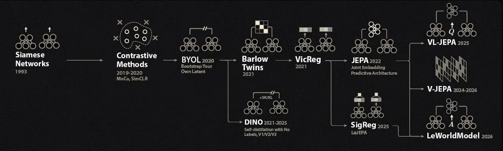

## Context on Self Supervised Learning


*Image from Welch Labs*

Every vision model you will touch in a contest is, at its core, an embedding machine: it maps an input $x$ to a vector $z = f_\theta(x) \in \mathbb{R}^d$ where semantically similar inputs should land close together. Everything you actually score (a linear probe, a kNN, cosine-similarity matching between two images) is a cheap geometric readout of that space. Supervised training shapes this geometry with labels, but labels are exactly what contest tasks withhold: you typically get a large unlabeled pool and, at best, a small labeled subset.

Self-supervised learning manufactures the supervisory signal from the data itself. The dominant recipe is joint embedding: take an image, produce two augmented views of it (random crops, flips, color jitter, blur), and train the encoder so both views map to nearby embeddings. The augmentation pipeline defines what the encoder becomes invariant to, so the embedding keeps semantics and discards nuisance variation. The catch is collapse: the constant function $f_\theta(x) = c$ makes every pair of views agree perfectly while encoding nothing. Every SSL method is, at heart, a different mechanism for pulling views together while forbidding that trivial solution. The map above shows the resulting zoo; this post is about which animals are worth bringing to a 6 hour contest on one GPU with under 24GB of VRAM, where a method is only as good as its convergence speed and its line count.

The standard contest workflow is: pretrain an encoder on the unlabeled pool with one of the methods below, then fit a cheap readout (linear probe, kNN, or a small head) on whatever labeled data exists. If the task is a matching or retrieval task, you can often skip the readout entirely and use the embeddings directly.

## Difference with Semi Supervised Learning

When some of the data does have labels, you are in semi-supervised territory, and this is the most common setup in practice: a small labeled split, a large unlabeled pool, and a test set from the same classes. The semi-supervised toolbox is smaller and more practical than the SSL one, and it should be your first stop before any representation learning.

**Pseudo-labeling** is the easy default, the fastest and easiest to implement: train on the labeled set, predict on the unlabeled pool, keep the predictions whose confidence clears a threshold as hard labels, fold them into the training set, and continue training. It is roughly ten lines of code, it runs while you think about the problem, and as a baseline it is annoyingly strong. Its failure mode is confirmation bias: wrong pseudo-labels get reinforced, so the confidence threshold (quality over quantity) is the whole trick.

[FixMatch](https://arxiv.org/abs/2001.07685) is the more powerful version of the same idea and the canonical contest method. It generates the pseudo-label from a weakly augmented view (flip and crop only) and enforces it as the target on a strongly augmented view (RandAugment or CTAugment, plus Cutout) of the same image:

$$
\ell_u = \frac{1}{\mu B} \sum_{b=1}^{\mu B} \mathbf{1}(\max q_b \geq \tau) \, H\big(\hat q_b, \, p_m(y \mid \mathcal{A}(u_b))\big), \qquad q_b = p_m(y \mid \alpha(u_b)),
$$

where $\alpha$ is the weak augmentation, $\mathcal{A}$ the strong one, $\hat q_b = \arg\max q_b$ the hard pseudo-label, $H$ cross-entropy, and $\tau = 0.95$ the confidence threshold. The total loss is $\ell_s + \lambda_u \ell_u$, with $\ell_s$ ordinary cross-entropy on weakly augmented labeled images. Two details do the heavy lifting: thresholding, which keeps only high-quality pseudo-labels and gives a free curriculum (early in training almost nothing passes), and the strength of $\mathcal{A}$, which makes the consistency target nontrivial. The implementation is a few lines on top of a normal training loop:

```py title="fixmatch.py"
q = model(weak(u)).softmax(-1)           # pseudo-label guess on the weak view
conf, pseudo = q.max(-1)                 # confidence + hard label
mask = conf > tau                        # keep only confident guesses

loss_u = F.cross_entropy(model(strong(u)), pseudo, reduction="none")
loss = loss_s + lambda_u * (loss_u * mask).mean()
```

The one assumption to check in a contest: the unlabeled pool should cover roughly the same classes as the labeled set. If that holds and labels are scarce, FixMatch is very hard to beat per line of code.

A small note for those interested: [FlexMatch](https://arxiv.org/abs/2110.08263) fixes the one remaining rigidity, the fixed threshold. It keeps a per-class threshold $T_t(c) = \mathcal{M}(\beta_t(c)) \cdot \tau$, where $\beta_t(c)$ is the normalized count of unlabeled samples predicted as class $c$ above $\tau$ (a free running estimate of how well each class is learned) and $\mathcal{M}(x) = x / (2 - x)$ a convex map. Hard classes temporarily get lower thresholds, easy classes converge back to $\tau$, and convergence speeds up by up to $5\times$ for almost zero extra code.

## Avoid "Contrastive" methods

SimCLR is the canonical contrastive method and the one every survey opens with, which is exactly why it is a trap in contests. The idea: two augmented views of the same image form a positive pair, every other sample in the batch is a negative, and you optimize the NT-Xent loss:

$$
\ell_{i,j} = -\log \frac{\exp(\mathrm{sim}(z_i, z_j) / \tau)}{\sum_{k=1}^{2N} \mathbf{1}_{k \neq i} \, \exp(\mathrm{sim}(z_i, z_k) / \tau)}, \qquad \mathrm{sim}(u, v) = \frac{u^\top v}{\lVert u \rVert \, \lVert v \rVert}.
$$

All the learning signal lives in the denominator: the model improves by pushing $z_i$ away from $2N - 2$ negatives, so the quality of training scales directly with batch size. The published recipe leans into this: batches of 4096 on TPU pods, the LARS optimizer, hundreds of epochs. On a single GPU under 24GB you cannot fit anywhere near that batch size for a useful encoder at a useful resolution, and even a weaker run needs far more epochs than a contest schedule allows. Training SimCLR fast-paced mid-contest is not practical; treat it as a reference point, not a tool.

[MoCo](https://arxiv.org/abs/1911.05722) does fix the batch-size problem. It decouples the negatives from the batch by keeping a FIFO queue of embeddings from previous batches (tens of thousands of negatives at batch size 256), encoded by a slowly moving momentum encoder $\theta_k \leftarrow m \, \theta_k + (1 - m) \, \theta_q$ so the queued keys stay consistent:

$$
\mathcal{L}_q = -\log \frac{\exp(q \cdot k_+ / \tau)}{\sum_{i=0}^{K} \exp(q \cdot k_i / \tau)}.
$$

It trains well on modest hardware. The problem is the implementation surface: queue management, a second encoder, momentum updates, and shuffled batch norm in the multi-GPU version. That is far too much code to write and debug under time pressure for a result you can get cheaper. Not worth it.

## Self-Distillation methods

Self-distillation methods drop the negatives entirely: one network predicts the output of another, and collapse is avoided through asymmetry (a predictor head, a stop-gradient, sometimes a momentum teacher) instead of through the loss. These are actually useful and practical for a contest: they converge at normal batch sizes, need no queue, and the only small downside is the code implementation, meaning two networks and a bit of bookkeeping instead of one loss term.

### [BYOL](https://arxiv.org/abs/2006.07733)

Bootstrap Your Own Latent uses two networks of the same architecture. The online network (encoder, projector, predictor) is trained by gradient descent; the target network (encoder, projector) is never trained, it is an exponential moving average of the online weights, $\xi \leftarrow \tau \xi + (1 - \tau) \, \theta$. Given the two views, the online predictor regresses the target projection of the other view with a normalized MSE, which is just a rescaled cosine similarity:

$$
\mathcal{L}_\theta = \big\lVert \bar q_\theta(z_\theta) - \bar z'_\xi \big\rVert_2^2 = 2 - 2 \, \frac{\langle q_\theta(z_\theta), \, z'_\xi \rangle}{\lVert q_\theta(z_\theta) \rVert_2 \, \lVert z'_\xi \rVert_2},
$$

symmetrized by swapping which view goes through which network, with stop-gradient on the target side. Three ingredients together prevent collapse: the predictor (it gives the online side a way to be asymmetric to the target), the stop-gradient, and the slow-moving EMA target. Batch size barely matters, 256 works fine. The costs are two networks in memory (the target is forward-only, so it is cheaper than it sounds) and the EMA bookkeeping.

### [SimSiam](https://arxiv.org/abs/2011.10566)

SimSiam asks which of BYOL's ingredients are actually necessary and answers: not the momentum encoder. A plain siamese network with a predictor and a stop-gradient is enough:

$$
\mathcal{L} = \frac{1}{2} D\big(p_1, \mathrm{sg}(z_2)\big) + \frac{1}{2} D\big(p_2, \mathrm{sg}(z_1)\big), \qquad D(p, z) = -\frac{p}{\lVert p \rVert_2} \cdot \frac{z}{\lVert z \rVert_2},
$$

where $z$ is the projector output, $p$ the predictor output, and $\mathrm{sg}$ the stop-gradient. Remove the stop-gradient and training degenerates within a few steps; remove the predictor and it also collapses. Together they make the simplest method of the family: no EMA, no queue, works at batch 256 with plain SGD, and it converges quickly on contest-sized data. If you want a distillation method mid-contest, this is the one that fits in your head.

Self-distillation is also used to train the [DINO](https://arxiv.org/abs/2104.14294) models, among a lot of other techniques and heuristics. It's mostly useful only as a pretrained model, not to reproduce its training recipe during a contest.

## Regularization methods

Regularization methods come at collapse from a different angle. Collapse is a statement about the statistics of the embedding batch (a constant output, or all variance concentrated in a few dimensions), so instead of fixing it with negatives or architectural asymmetry, constrain the statistics directly: pull the embeddings of two views together, keep each embedding dimension spread out over the batch, and keep the dimensions decorrelated from each other. The result is a clean and beautiful implementation: a siamese forward pass plus one loss term, with no negatives, no second network, no stop-gradient, and no big batch size requirement beyond what statistics need to be meaningful.

### [VICReg](https://arxiv.org/abs/2105.04906)

VICReg is the sweet spot between complexity and efficient convergence, and the loss is the entire method:

$$
\ell(Z, Z') = \lambda \, s(Z, Z') + \mu \, v(Z) + \nu \, c(Z), \qquad \lambda = \mu = 25, \; \nu = 1.
$$

The invariance term is plain MSE between the two views' embeddings, $s(Z, Z') = \frac{1}{N} \sum_i \lVert z_i - z'_i \rVert_2^2$. The variance term hinges the per-dimension standard deviation to stay above 1 along the batch, $v(Z) = \frac{1}{d} \sum_j \max\big(0, 1 - \sqrt{\mathrm{Var}(z^j) + \epsilon}\big)$, which kills complete collapse: a constant encoder has zero std and pays the full penalty. The covariance term penalizes the off-diagonal entries of the embedding covariance matrix, $c(Z) = \frac{1}{d} \sum_{i \neq j} [C(Z)]_{i,j}^2$, which kills informational collapse by forcing the dimensions to carry different content. And this really is all of it:

```py title="VICReg loss"
def VICReg(z1, z2, sim_weight=25, var_weight=25, cov_weight=1):
    # invariance loss
    sim_loss = (z1 - z2).square().mean()

    # variance loss
    std1 = torch.sqrt(z1.var(dim=0) + 1e-4)
    std2 = torch.sqrt(z2.var(dim=0) + 1e-4)
    var_loss = (F.relu(1 - std1).mean() + F.relu(1 - std2).mean()) / 2

    # covariance loss
    B, D = z1.shape
    z1 = z1 - z1.mean(dim=0)
    z2 = z2 - z2.mean(dim=0)

    cov1 = z1.T @ z1 / (B - 1)
    cov2 = z2.T @ z2 / (B - 1)

    cov_loss = (
        cov1.square().sum() - cov1.diagonal().square().sum()
        + cov2.square().sum() - cov2.diagonal().square().sum()
    ) / D

    return sim_weight * sim_loss + var_weight * var_loss + cov_weight * cov_loss
```

No predictor, no teacher, no momentum: the same network processes both views and the loss does everything. In practice it converges quickly at whatever batch size fits your card, the three terms are individually interpretable (you can watch the variance saturate and know the run is healthy), and the published weights transfer without tuning. When a contest task calls for pretraining from scratch, this is my default.

### [SIGReg](https://arxiv.org/abs/2511.08544)

Now as for newer methods: these come with diminishing returns for contests (more code, no huge improvement at contest scale), so treat the rest of this section as a reference for being aware of SOTA rather than a recommendation.

SIGReg replaces VICReg's moment matching with an actual statistical test. The motivating result, from the LeJEPA paper, is that the optimal embedding distribution for unknown downstream tasks is the isotropic Gaussian: it provably minimizes the worst-case downstream risk for both linear and nonlinear probes. Collapse prevention then becomes distribution matching: push the embedding batch toward $\mathcal{N}(0, I)$. Doing that directly in high dimension is intractable, so SIGReg sketches it. Project the embeddings onto $M$ random unit directions (by Cramér-Wold, matching all 1D projections implies matching the full distribution), and on each projection compare the empirical characteristic function $\hat\varphi(t) = \frac{1}{N} \sum_n e^{i t a^\top z_n}$ against the Gaussian one $\varphi(t) = e^{-t^2 / 2}$ using the Epps-Pulley statistic:

$$
T = N \int_{-\infty}^{\infty} \big| \hat\varphi(t) - \varphi(t) \big|^2 e^{-t^2 / 2} \, dt,
$$

evaluated with 17 trapezoid points on $t \in [-5, 5]$. Characteristic functions are bounded and smooth, so the loss and its gradients are bounded by construction, and the cost is linear in batch size and embedding dimension. Resampling fresh directions every step means a few hundred slices per batch are enough.

### [LeJEPA](https://arxiv.org/abs/2511.08544)

JEPA (joint-embedding predictive architecture) refers to a method for training SSL models. The core idea is to predict different views from images *in the embedding space*, thus focusing on semantics and not exact pixels (is it day or night? instead of what's the exact shape of the clouds on the sky). Traditionally JEPA required quite a few tricks to train, but now recent research managed to produce a heuristic-free recipe.

LeJEPA combines SIGReg with the plain JEPA view-prediction loss, and that is the whole recipe: pull every view's embedding toward the mean embedding of the global views, regularize each view's distribution toward the isotropic Gaussian, with a single trade-off hyperparameter $\lambda$:

$$
\mathcal{L} = (1 - \lambda) \, \big\lVert \bar z_{\text{global}} - z_{\text{view}} \big\rVert^2 + \lambda \, \mathrm{SIGReg}(z).
$$

No stop-gradient, no teacher-student, no EMA, no schedulers; the paper reports stable training from ResNets up to a 1.8B parameter ViT-g, and the DDP-friendly implementation is about 50 lines:

```py
def LeJEPA(global_views: list[torch.Tensor], all_views: list[torch.Tensor], lambd: float):
    # embedding of global views
    g_emb = forward(torch.cat(global_views))

    # embedding of local views
    # if resnet: skip with a_emb = g_emb
    a_emb = forward(torch.cat(all_views))

    # LeJEPA loss
    centers = g_emb.view(-1, bs, K).mean(0)
    a_emb = a_emb.view(-1, bs, K)
    sim = (centers - a_emb).square().mean()
    sigreg = mean(SIGReg(emb, global_step) for emb in a_emb)
    return (1 - lambd) * sim + lambd * sigreg
```

Again, I don't recommend implementing SIGReg or [VISReg](https://arxiv.org/abs/2606.02572) in a contest, but this is the direction in which SOTA models are going. Expect in the coming years for the foundational vision models to be trained using these heuristic-free methods, replacing DINO more or less.

Another pretrained model worth knowing about, [V-JEPA 2](https://arxiv.org/abs/2506.09985) scales the JEPA idea to video: predict the EMA encoder's features of masked video tubelets from the visible ones with an L1 loss, trained on over 1M hours of video up to a 1B parameter ViT-g, currently one of the strongest video backbones you can download (its action-conditioned sibling even does zero-shot robot planning from only 62 hours of robot data).
## Conclusion

Contest SSL is less about finding the strongest method and more about finding the cheapest one that cannot collapse. The ordering I would follow under time pressure:

- **Labels exist, even few:** start with pseudo-labeling, it is ten lines and runs while you think. Upgrade to FixMatch when the labeled set is small and clean; it is the best accuracy per line of code in this post.
- **No labels, pretraining from scratch:** VICReg. One loss term, no batch-size requirements, fast convergence, interpretable training dynamics. BYOL or SimSiam if you prefer the distillation route and can afford the extra code.
- **Never mid-contest:** SimCLR (the batch size and epoch count will not fit) and MoCo (it works, but the queue plus momentum encoder is too much code to debug in 6 hours).
- **Pretrained models allowed:** use whatever is provided, for SSL models it's likely DINO

The deeper pattern worth remembering is that all of these methods answer the same question: how do you pull views together without collapsing to a constant? Contrastive methods answer with negatives, distillation with asymmetry, regularization with statistics. Contests reward the cheapest correct answer.

Practice tasks (easiest -> hardest):
- "Find Brain Tumors": [Kaggle link](https://www.kaggle.com/competitions/aicc-round-0-brain-tumor) (AICC Round 0): FixMatch, BYOL, VICReg
- "Grid Collage": [baseline notebook](https://github.com/stefanasandei/roai-solved/blob/main/international-contests/ioai/2025/mock-contest/baseline/IOAI2025%20Online%20Practice%20Contest%20Grid%20Collage%20Classification%20S1.ipynb) (IOAI 2025 Mock Contest): Pseudo Labels
- "Toilet Sign Matching": [MLC link](https://platform.olimpiada-ai.ro/en/problems/73) (IOAI 2025 day 2): VICReg
- "Broken": [Nitro Judge link](https://judge.nitro-ai.org/competitions/cram-school/preonia-2026/2/view) (CramSchool preONIA 2026): LeJEPA

Good luck and have fun!
